<h1 style="text-align: center;">Spring Boot Hands-On Projects</h1>

A collection of small, hands-on projects built with Spring Boot and frontend technologies. Designed as practical exercises to learn and apply full-stack development concepts, including MVC patterns, REST APIs, real-time features, and front-end integration.

---

## Projects

### 1. Chat Application (MVC)

Basic socket & real-time messaging and users tracking.

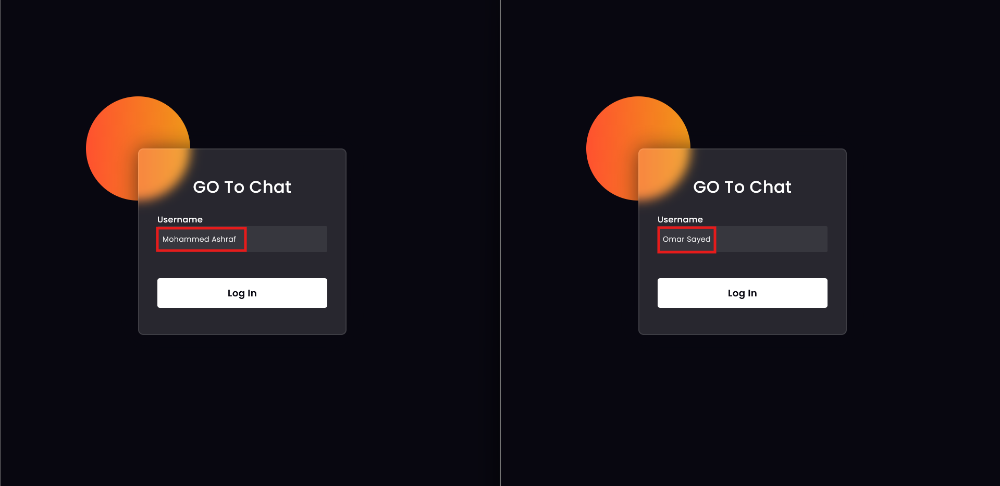
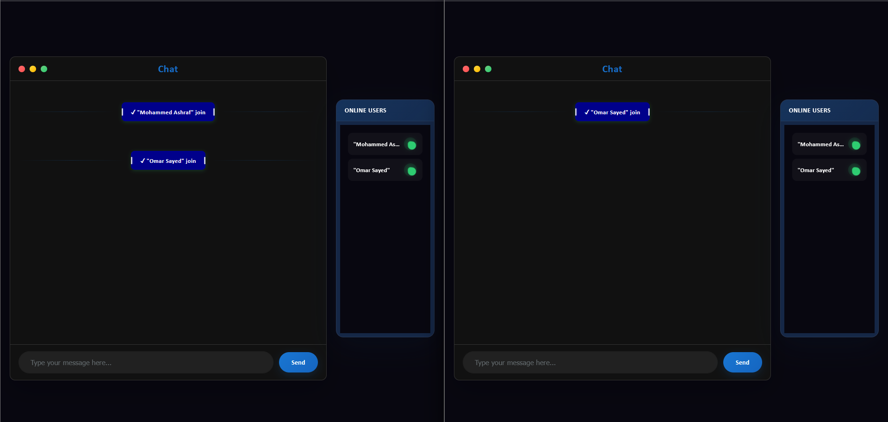
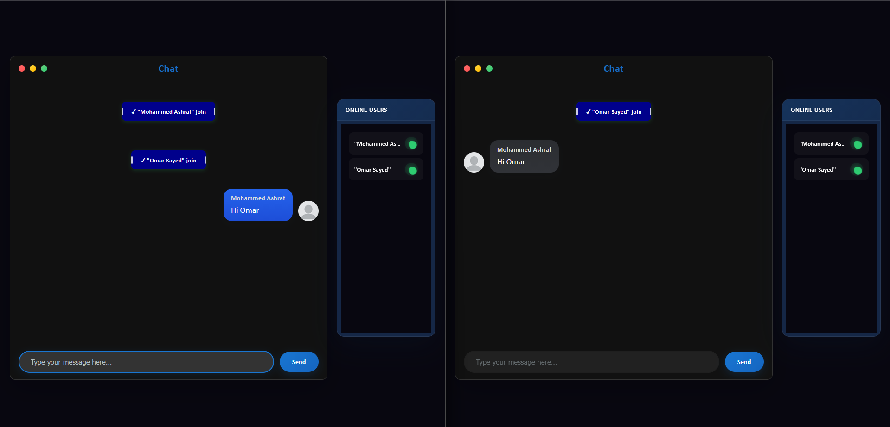
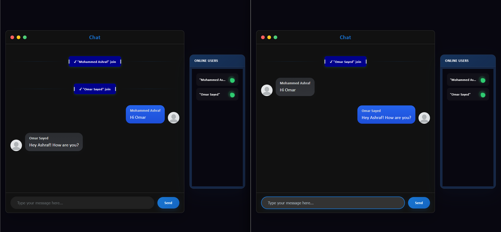
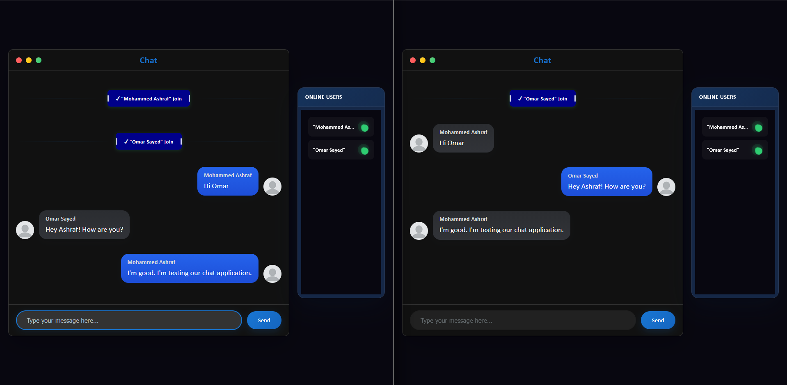
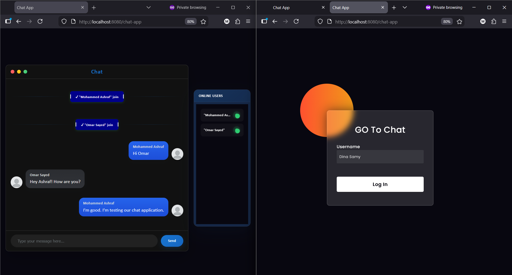
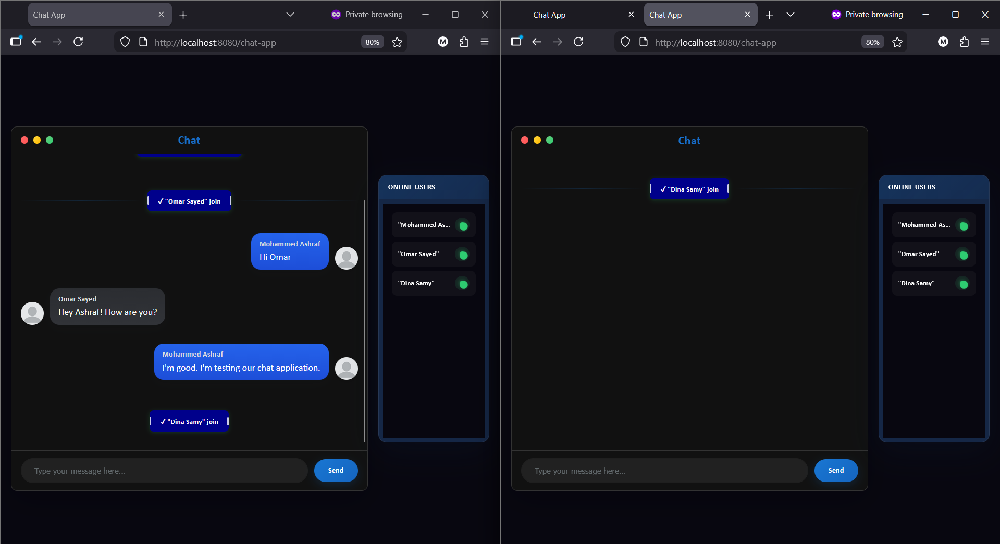
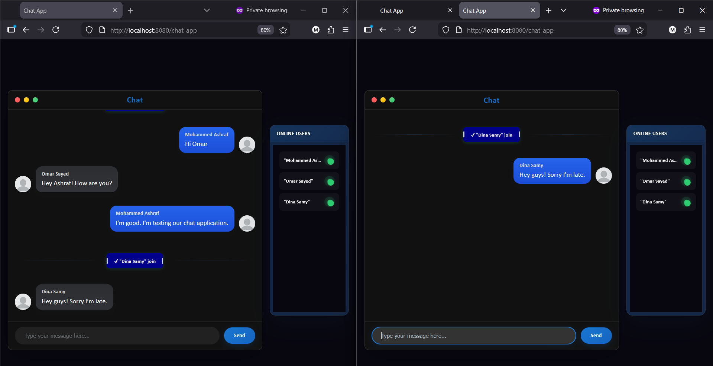
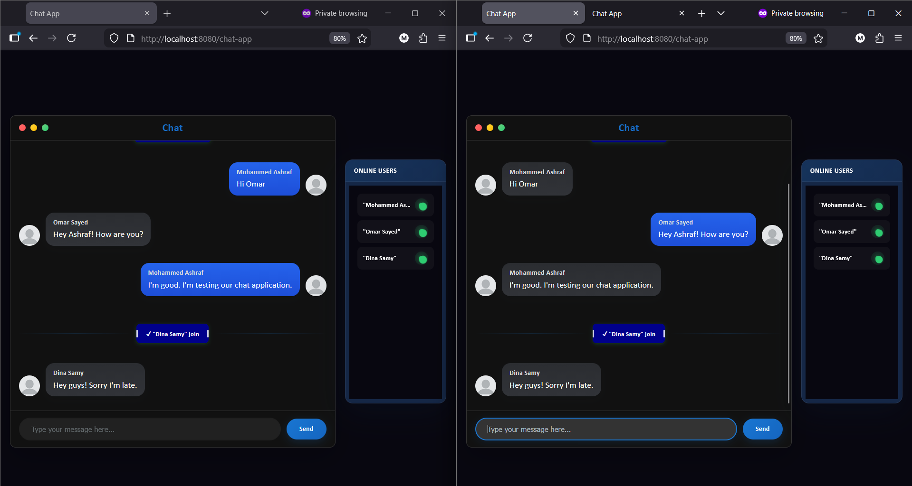
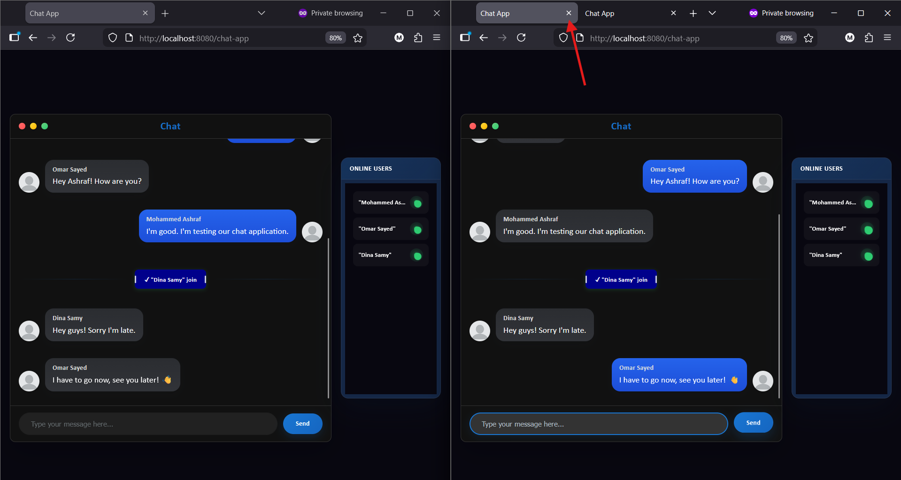
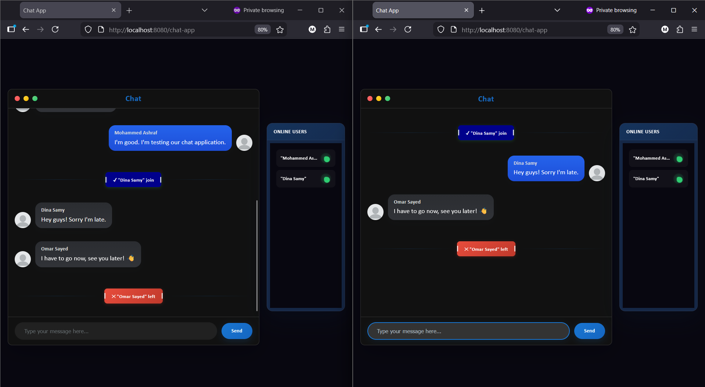

---

### 2. Todo List (MVC)

Basic CRUD and task management.

---

### 3. E-commerce Store (React & MUI + Spring Boot & MySql)

Frontend-Backend integration.
- Products Pagination & Sorting
- Products Filtering
- Products Search

